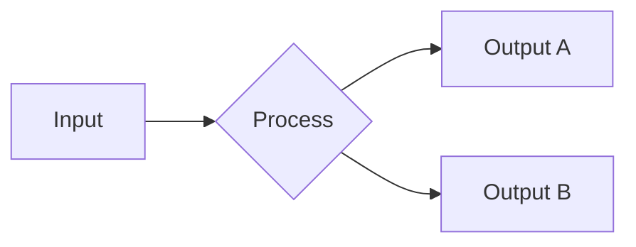

# mdBook Structure Reference

## book.toml — Full Configuration

```toml
[book]
title = "Project Name Documentation"
authors = ["Team Name"]
description = "Comprehensive documentation for Project Name"
language = "en"
src = "src"
multilingual = false

[build]
build-dir = "book"              # Output directory
create-missing = true           # Auto-create files from SUMMARY.md
use-default-preprocessors = true

[output.html]
git-repository-url = "https://github.com/org/project"
git-repository-icon = "fa-github"
edit-url-template = "https://github.com/org/project/edit/main/docs/{path}"
site-url = "/project-docs/"
default-theme = "light"
preferred-dark-theme = "ayu"
smart-punctuation = true
additional-css = ["theme/custom.css"]
additional-js = ["theme/custom.js"]
no-section-label = false

[output.html.fold]
enable = true                   # Collapsible sidebar sections
level = 1                       # Fold at level 1 by default

[output.html.search]
enable = true
limit-results = 30
teaser-word-count = 30
use-hierarchical-headings = true
boost-title = 2
boost-hierarchy = 1
boost-paragraph = 1
expand = true
heading-split-level = 3
copy-js = true

[output.html.playground]
editable = false                # Enable editing in Rust playground
copyable = true
copy-js = true
runnable = true

# Preprocessors
[preprocessor.links]            # Built-in: {{#include}} etc.

[preprocessor.index]            # Built-in: README.md → index.html

# Optional preprocessors (install separately)
# [preprocessor.mermaid]        # cargo install mdbook-mermaid
# [preprocessor.toc]            # cargo install mdbook-toc
# [preprocessor.admonish]       # cargo install mdbook-admonish
```

## SUMMARY.md — Patterns

### Basic Structure

```markdown
# Summary

[Introduction](introduction.md)

# Getting Started

- [Installation](getting-started/installation.md)
- [Quick Start](getting-started/quick-start.md)
- [Configuration](getting-started/configuration.md)

# User Guide

- [Basic Usage](guides/basic-usage.md)
  - [Feature A](guides/feature-a.md)
  - [Feature B](guides/feature-b.md)
- [Advanced Usage](guides/advanced-usage.md)
  - [Custom Pipelines](guides/custom-pipelines.md)
  - [Plugin System](guides/plugins.md)

# Architecture

- [Overview](architecture/overview.md)
- [Design Decisions](architecture/design-decisions.md)

# API Reference

- [Core Module](api-reference/core.md)
- [Config Module](api-reference/config.md)

# Operations

- [Deployment](operations/deployment.md)
- [Troubleshooting](operations/troubleshooting.md)

---

[Contributing](contributing.md)
[Changelog](changelog.md)
```

### Rules

- `[Title](path.md)` at the root level (before any `#`) = prefix chapters (shown before parts)
- `# Part Title` = visual separator in sidebar, not a link
- `- [Title](path.md)` = numbered chapter within a part
- Indented `- [Title](path.md)` = sub-chapter (up to 3 levels)
- `---` separator = suffix chapters follow (shown after all parts)
- Draft chapters: `- [Title]()` (empty parens) = placeholder, not rendered in build

## Include Directives

### Include file content
```markdown
{{#include ../path/to/file.rs}}
```

### Include specific lines
```markdown
{{#include ../path/to/file.rs:5:15}}
```

### Include by anchor (recommended for stability)
In source file:
```rust
// ANCHOR: example_name
fn important_code() {
    // This will be included
}
// ANCHOR_END: example_name
```

In markdown:
```markdown
{{#include ../path/to/file.rs:example_name}}
```

### Rustdoc-style include
```markdown
{{#rustdoc_include ../path/to/file.rs:5:15}}
```
Hidden lines (starting with `#`) are included but hidden in rendered output.

### Include from playground
```markdown
{{#playground ../path/to/file.rs}}
```

## Hidden Lines in Rust Blocks

Lines prefixed with `# ` are hidden in rendered output but included when testing:

````markdown
```rust
# use std::io;
# fn main() -> io::Result<()> {
let content = std::fs::read_to_string("file.txt")?;
println!("{content}");
# Ok(())
# }
```
````

The reader sees only the two relevant lines, but `mdbook test` compiles the full program.

## Admonishments (with mdbook-admonish)

```markdown
```admonish warning
This operation is destructive and cannot be undone.
```

```admonish tip
Use `--dry-run` to preview changes before applying them.
```

```admonish info title="Compatibility Note"
This feature requires version 2.0 or later.
```

```admonish example
See the [examples directory](https://github.com/org/project/tree/main/examples) for complete working code.
```
```

Without `mdbook-admonish`, use blockquotes with emoji:

```markdown
> ⚠️ **Warning:** This operation is destructive.

> 💡 **Tip:** Use `--dry-run` to preview changes.

> ℹ️ **Note:** Requires version 2.0+.
```

## Diagrams (with mdbook-mermaid)

````markdown

````

## Testing

```bash
# Build and check for warnings
mdbook build

# Test all Rust code examples
mdbook test

# Serve locally with auto-reload
mdbook serve --open

# Clean build artifacts
mdbook clean
```

## CI/CD Integration

GitHub Actions example:

```yaml
name: Deploy Docs
on:
  push:
    branches: [main]
    paths: ['docs/**']

jobs:
  deploy:
    runs-on: ubuntu-latest
    steps:
      - uses: actions/checkout@v4
      - name: Install mdBook
        run: |
          cargo install mdbook
          # cargo install mdbook-mermaid mdbook-admonish  # if needed
      - name: Build
        run: mdbook build docs
      - name: Deploy to GitHub Pages
        uses: peaceiris/actions-gh-pages@v3
        with:
          github_token: ${{ secrets.GITHUB_TOKEN }}
          publish_dir: ./docs/book
```
