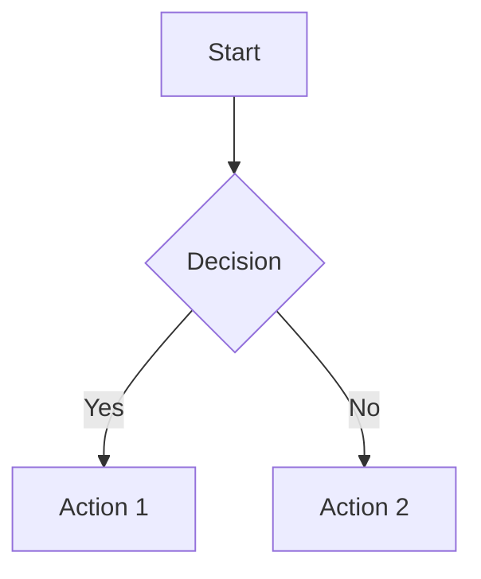
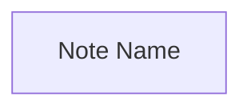

# Obsidian Markdown Syntax Reference

Complete reference for Obsidian-flavored Markdown. Obsidian extends CommonMark and GitHub Flavored Markdown with its own syntax for linking, embedding, and metadata.

## Properties (YAML Frontmatter)

Properties store structured metadata at the top of each note, delimited by `---`:

```yaml
---
aliases:
  - Alt Name
  - Acronym
tags:
  - topic
  - topic/subtopic
created: 2026-04-10
status: permanent
cssclasses:
  - wide-page
---
```

### Property Types

| Type | Format | Example |
|------|--------|---------|
| Text | Single-line string | `author: Jane Doe` |
| List | YAML list with hyphens | `tags:\n  - rust\n  - async` |
| Number | Integer or decimal | `priority: 3` |
| Checkbox | `true` / `false` | `reviewed: true` |
| Date | `YYYY-MM-DD` | `created: 2026-04-10` |
| Date & time | ISO 8601 | `modified: 2026-04-10T14:30:00` |

### Default Properties

- `tags` — note categorization (only property that supports tag type)
- `aliases` — alternative names for linking and search
- `cssclasses` — custom CSS classes for individual note styling

### Rules

- Use colon-space separation: `key: value`
- Internal links in properties require quotes: `related: "[[other-note]]"`
- JSON format is read but auto-converts to YAML on save
- Nested properties are not supported

## Internal Links (Wikilinks)

### Basic Link

```markdown
[[Note Name]]
```

### Link with Display Text

```markdown
[[Note Name|Custom display text]]
```

### Link to Heading

```markdown
[[Note Name#Heading]]
[[Note Name#Main Heading#Subheading]]
[[#Heading in same note]]
```

### Link to Block

```markdown
[[Note Name#^block-id]]
[[#^block-id]]
```

Block IDs are defined by appending `^identifier` to any paragraph:

```markdown
This is a referenceable paragraph. ^my-block-id
```

### Markdown-Style Links

```markdown
[Display text](Note%20Name.md)
[Display text](Note%20Name.md#heading)
```

Spaces must be URL-encoded as `%20` in Markdown-style links.

### Filename Restrictions

Avoid these characters in note names: `# | ^ : %% [[ ]]`

## Embeds

Prefix a link with `!` to embed content inline:

```markdown
![[Note Name]]              <!-- Embed entire note -->
![[Note Name#Heading]]      <!-- Embed specific section -->
![[Note Name#^block-id]]    <!-- Embed specific block -->
![[image.png]]              <!-- Embed image -->
![[image.png|640x480]]      <!-- Embed image with dimensions -->
![[image.png|640]]          <!-- Embed image with width only -->
![[audio.mp3]]              <!-- Embed audio player -->
![[video.mp4]]              <!-- Embed video player -->
![[document.pdf]]           <!-- Embed PDF viewer -->
![[document.pdf#page=3]]    <!-- Embed PDF at specific page -->
```

## Tags

### Inline Tags

```markdown
#topic
#parent/child/grandchild
```

### In Properties

```yaml
tags:
  - topic
  - parent/child
```

### Rules

- Must contain at least one non-numeric character (`#1984` is invalid, `#y1984` is valid)
- Allowed characters: letters, numbers, underscores, hyphens, forward slashes, Unicode/emoji
- No spaces — use camelCase, snake_case, or kebab-case
- Case-insensitive for search, preserves case for display
- Nested tags: `#parent/child` — searching `#parent` matches all children

## Text Formatting

```markdown
**bold**                    or __bold__
*italic*                    or _italic_
~~strikethrough~~
==highlight==
**_bold italic_**
~~**bold strikethrough**~~
```

## Callouts

### Basic Callout

```markdown
> [!note]
> Content goes here with **Markdown** and [[wikilinks]].
```

### Custom Title

```markdown
> [!tip] My Custom Title
> Body content.
```

### Title Only (No Body)

```markdown
> [!info] Just a title line
```

### Foldable Callouts

```markdown
> [!warning]- Collapsed by default
> Hidden content revealed on click.

> [!tip]+ Expanded by default
> Visible content that can be collapsed.
```

### Nested Callouts

```markdown
> [!question] Outer callout
> Content here.
>> [!example] Inner callout
>> Nested content.
```

### Built-in Types

| Type | Aliases | Color |
|------|---------|-------|
| `note` | — | Blue |
| `abstract` | `summary`, `tldr` | Cyan |
| `info` | — | Blue |
| `todo` | — | Blue |
| `tip` | `hint`, `important` | Cyan |
| `success` | `check`, `done` | Green |
| `question` | `help`, `faq` | Yellow |
| `warning` | `caution`, `attention` | Orange |
| `failure` | `fail`, `missing` | Red |
| `danger` | `error` | Red |
| `bug` | — | Red |
| `example` | — | Purple |
| `quote` | `cite` | Gray |

Type identifiers are case-insensitive. Unsupported types default to `note` style.

## Code Blocks

### Inline Code

```markdown
Use `backticks` for inline code.
```

### Fenced Code Block

````markdown
```rust
fn main() {
    println!("Hello, world!");
}
```
````

### Nested Code Blocks

Use more backticks in the outer fence than the inner:

`````markdown
````markdown
```rust
fn example() {}
```
````
`````

## Lists

### Unordered

```markdown
- Item (or * or +)
  - Nested item
    - Deeper nesting
```

### Ordered

```markdown
1. First
2. Second
   1. Sub-item
```

### Task Lists

```markdown
- [ ] Incomplete task
- [x] Completed task
```

## Tables

```markdown
| Column 1 | Column 2 | Column 3 |
| :-------- | :------: | -------: |
| Left      | Center   | Right    |
```

- Left-aligned: `:--`
- Center-aligned: `:--:`
- Right-aligned: `--:`
- Header row needs at least two hyphens per column
- Supports Markdown formatting, wikilinks, and embeds inside cells
- Escape `|` with `\|` when using aliases or image sizing inside tables

## Math (MathJax / LaTeX)

### Inline Math

```markdown
Euler's identity: $e^{i\pi} + 1 = 0$
```

### Display Math

```markdown
$$
\begin{vmatrix}
a & b \\
c & d
\end{vmatrix} = ad - bc
$$
```

## Diagrams (Mermaid)

````markdown

````

Link to notes from Mermaid nodes using `internal-link` class:

````markdown

````

## Footnotes

```markdown
This has a footnote[^1] and another[^note].

[^1]: Footnote content.
[^note]: Named footnote content.
```

## Comments

```markdown
%%
This text is invisible in reading view.
Only visible in editing view.
%%

Inline comment: some text %%hidden%% more text.
```

## Blockquotes

```markdown
> Single-line quote

> Multi-line quote
> continues here.
```

## Horizontal Rules

```markdown
---
***
___
```

(Must be on their own line with no other content.)

## HTML Support

Obsidian supports a subset of HTML:

```html
<u>underlined text</u>
<s>strikethrough</s>
<span style="color: red;">colored text</span>
<div class="custom-class">styled block</div>
<iframe src="https://example.com"></iframe>
<!-- HTML comment (cross-platform) -->
```

### Limitations

- **No Markdown inside HTML**: `<div>**bold**</div>` will NOT render bold
- **No blank lines inside HTML blocks**: breaks the block parsing
- `<script>` tags are sanitized and blocked
- `<span>` and `<a>` are inline tags — Markdown around them still works, but not inside

## Accepted File Formats

### Notes

- Markdown: `.md`
- Canvas: `.canvas`
- Bases: `.base`

### Images

`.avif`, `.bmp`, `.gif`, `.jpeg`, `.jpg`, `.png`, `.svg`, `.webp`

### Audio

`.flac`, `.m4a`, `.mp3`, `.ogg`, `.wav`, `.webm`, `.3gp`

### Video

`.mkv`, `.mov`, `.mp4`, `.ogv`, `.webm`

### Documents

`.pdf`

## Escaping

Use backslash to prevent formatting:

```markdown
\*not italic\*
\[[not a link\]]
\#not-a-tag
```
